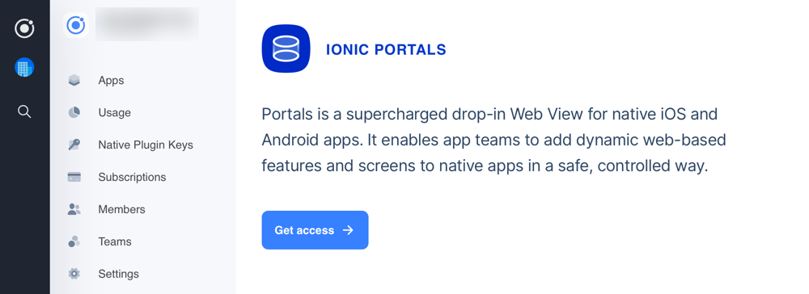
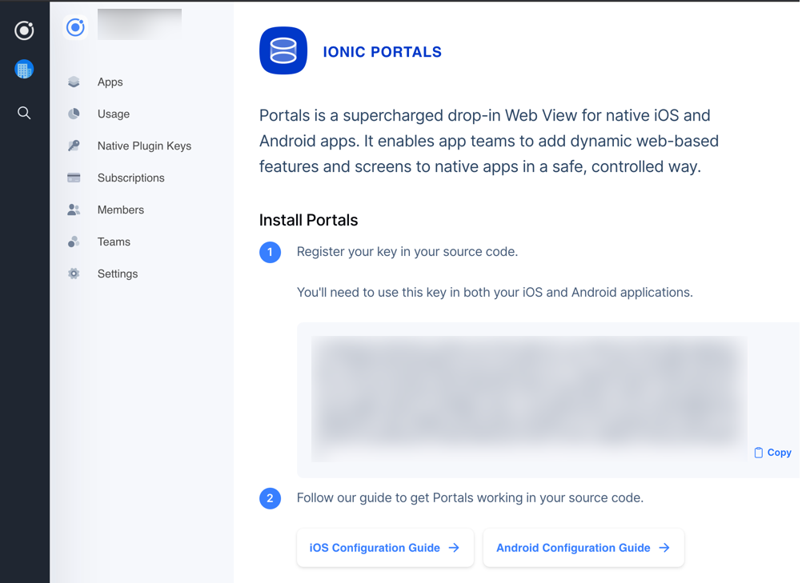

import Tabs from '@theme/Tabs';
import TabItem from '@theme/TabItem';
import CodeBlock from '@theme/CodeBlock';
import { getCapacitorVersion, getPortalsVersion } from '@site/src/util';

## Signup

To use Ionic Portals, you need to register for a product key. Getting a key is free and takes just a moment. 

Head over to the [Ionic Dashboard](https://dashboard.ionicframework.com/portals). If you do not already have an Ionic account, sign up for one.

 On the Ionic Portals screen, click the "Get access" button. You will be asked to fill out a short form:




Your key will now be available. Clicking the copy button will copy the entire key to your clipboard:



:::note
You only need to register for a product key once for each organization you belong to. You can return to the Portals Key section of the Ionic Dashboard to retrieve your key again at a later date.
:::

## Install

Ionic Portals is publicly available on Maven Central, Cocoapods, and NPM. 

<Tabs
defaultValue="ios"
values={[
{ label: 'iOS', value: 'ios', },
{ label: 'Android', value: 'android', },
{ label: 'Web', value: 'web', },
]}>
<TabItem value="ios">

To add Portals to your iOS project, put the following line to your `Podfile`:

<CodeBlock className="language-ruby" title="Podfile">
{`pod 'IonicPortals', '~> ${getPortalsVersion()}'`}
</CodeBlock>

And then run `pod install`.

</TabItem>
<TabItem value="android">

To add Portals to your Android project, add the dependency to your `build.gradle` files

<CodeBlock className="language-groovy" title="build.gradle">
{
`
// ----------------------------------------------
//  Module-level build.gradle
// ----------------------------------------------
dependencies {
    implementation 'io.ionic:portals:${getPortalsVersion()}'
}`.trim()
}
</CodeBlock>


And in the top level `build.gradle` file, be sure that you include `jcenter` and `maven` in your repositories section

```groovy title=build.gradle
// ----------------------------------------------
//  Top-level build.gradle
// ----------------------------------------------
allprojects {
    repositories {
        google()

        // Make sure JCenter and Maven Central are
        // in your project repositories
        jcenter()
        mavenCentral()
    }
}
```

</TabItem>

<TabItem value="web">

To add Portals to your web project(s), install it via NPM:

<CodeBlock className="language-bash">
{`
npm install @ionic/portals@${getPortalsVersion()}
`.trim()
}
</CodeBlock>

</TabItem>

</Tabs>

:::info
It is important to keep the version of Portals in sync between all the platforms.
:::

## Configure

After installing the depenency you need to register your copy of Ionic Portals at runtime. This will work both offline and in production. You'll need to call [PortalManager.register(myApiKey)](../reference/android/portal-manager#register) before creating any Portals in your app. Below is a simple example of how to bootstrap Ionic Portals before loading any Portal instances in your app. To get an API Key, refer to the [Sign Up](#signup) section.

<Tabs
defaultValue="ios"
values={[
{ label: 'iOS', value: 'ios', },
{ label: 'Android', value: 'android', },
]}>
<TabItem value="ios">

```swift title=AppDelegate.swift
import SwiftUI
import IonicPortals

@main
class AppDelegate: NSObject, UIApplicationDelegate {
    func application(_ application: UIApplication, didFinishLaunchingWithOptions launchOptions: [UIApplication.LaunchOptionsKey : Any]? = nil) -> Bool {
        PortalManager.register("MY_API_KEY")
        // setup portals...
        return true
    }
}
```

</TabItem>
<TabItem value="android">

```kotlin title=MyApplication.kt
import android.app.Application
import io.ionic.portals.PortalManager

class MyApplication : Application() {
    override fun onCreate(): Unit {
        super.onCreate()
        PortalManager.register("MY_API_KEY")
        // setup portals...
    }}
}
```

</TabItem>
</Tabs>
