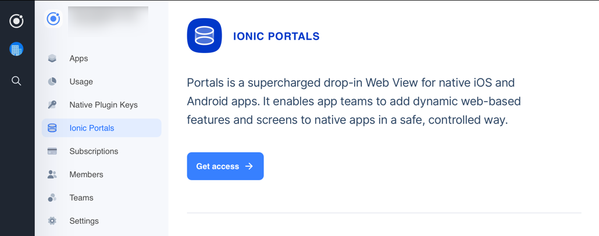

To use Ionic Portals, you need to register for a product key. Getting a key is free and takes just a moment. 

Head over to the [Ionic Dashboard](https://dashboard.ionicframework.com/portals). If you do not already have an Ionic account, sign up for one.

 On the Ionic Portals screen, click the "Get access" button. You will be asked to fill out a short form:

Your key will now be available. Clicking the copy button will copy the entire key to your clipboard:

From here, continue in the [Getting Started Guide](../getting-started/guide) on configuring the key in your Portals application.

:::note
You only need to register for a product key once for each organization you belong to. You can return to the Portals Key section of the Ionic Dashboard to retrieve your key again at a later date.
:::