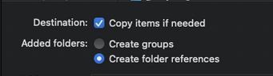

import Tabs from '@theme/Tabs';
import TabItem from '@theme/TabItem';

In order to use web applications in your native applications, you'll need to properly setup your project to be able to include a web bundle.

## Setup the Web Asset Directory

<Tabs 
    defaultValue="ios" 
    values={[
        { label: 'iOS', value: 'ios', },
        { label: 'Android', value: 'android', },
        { label: 'React Native', value: 'react-native' }
    ]}
>
<TabItem value="ios">

Your web application needs to be copied into your native application. On iOS, put your web assets in a directory at the same level that contains your main source and the `info.plist` file:


:::info
You must ensure that you add your web application root folder as a folder reference and not as a group in Xcode. Otherwise, your directory structure will be ignored and the Portal will not render. If you have completed this step successfully, the folder icon in Xcode will be **blue**.


:::


```swift
let portal = Portal(name: "myPortalWebApp")
// or...using a different portalId and starting directory
let helpPortal = Portal(name: "help", startDir: "myPortalWebApp")
```

</TabItem>
<TabItem value="android">

In Android, your web application needs to be in the assets folder; which by default is `src/main/assests`. For example, if your web application is a help page, you can put your web application in the `src/main/assets/help` folder. From there, you can either set the `portalId` for the Portal to `help` or you can manually specify `help` as the directory using the [.setStartDir()](../reference/android/portal-builder#setStartDir) function.

<Tabs 
    defaultValue="kt" 
    values={[
        { label: 'Kotlin', value: 'kt', },
        { label: 'Java', value: 'java', },
    ]}
>
<TabItem value="kt">

```kotlin
PortalManager.newPortal("help").create()

// or...

PortalManager.newPortal("MY_PORTAL_ID")
    .setStartDir("help")
    .create()
```

</TabItem>
<TabItem value="java">

```java
PortalManager.newPortal("help").create();

// or...

PortalManager.newPortal("MY_PORTAL_ID")
    .setStartDir("help")
    .create();
```

</TabItem>

</Tabs>

</TabItem>
<TabItem value="react-native">

Follow the instructions for both Android and iOS in your native applications. You should make the start directories the same between both platforms to avoid issues rendering a Portal.

```javascript
import { addPortal } from '@ionic/portals-react-native';

const help = {
  name: 'myPortalWebApp'
};
// or...using a different portalId and starting directory
const help = {
  name: 'help',
  startDir: 'myPortalWebApp'
};
```

</TabItem>
</Tabs>

## Automating the Process

Once you have your web code and native code linked up, you will need a process to continually copy in new versions of the web application into your mobile projects. 

We recommend having some type of automation set up so the mobile developer doesn't have to manually copy over the web code every time there is a new change. We have a few guides for ideas to do so in a [monorepo](../tutorials/monorepo-example) or [git submodules](https://git-scm.com/book/en/v2/Git-Tools-Submodules).
